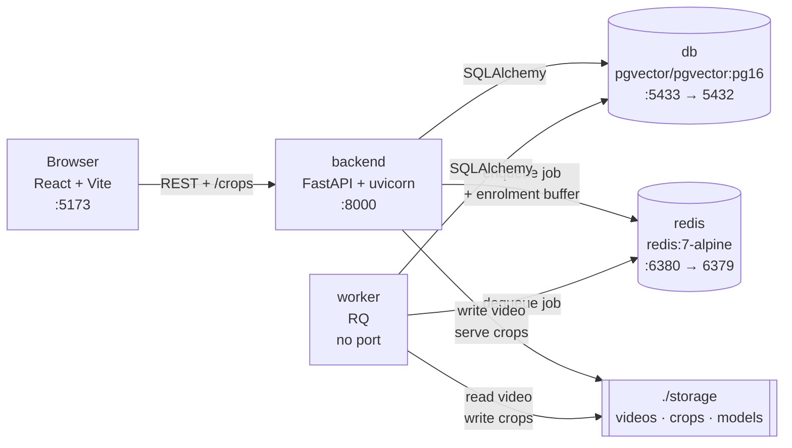
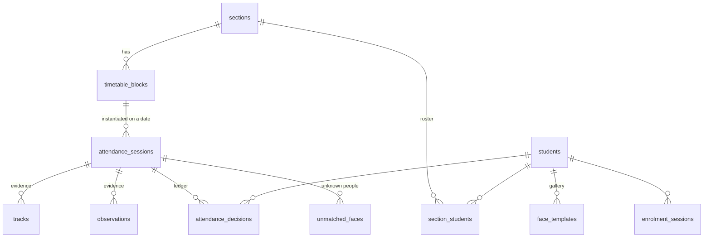
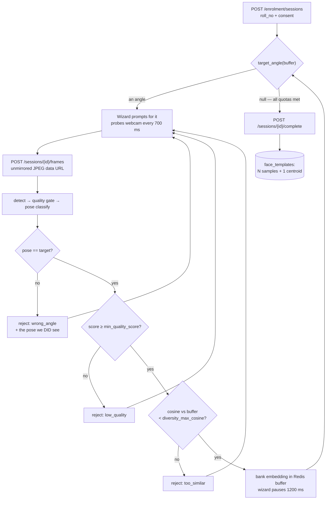
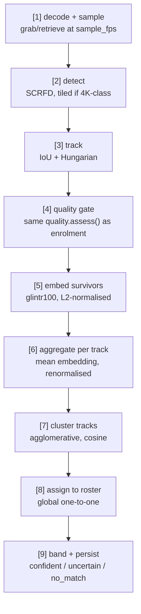

# SentinelFace — Architecture

Complete description of what this system is made of, how the pieces fit, and why each boundary is
where it is.

Companion documents:
- **`INIT.md`** — the build specification. Section numbers cited here (§7.3, §8.5, …) refer to it.
- **`DECISIONS.md`** — every choice `INIT.md` did not make for us, with the evidence behind it.
  Cited here as D1…D11.

---

## 1. What the system does

Attendance is recorded from a **video of a classroom**, not from a live gate or a kiosk. A faculty
member picks a timetable block, uploads the footage, and gets back a per-student present/absent
ledger with a visual crop as evidence for every decision.

### 1.1 The core design idea

Two constraints make this tractable where general face recognition would not be:

**Closed-set matching.** A face in the video is never compared against every enrolled student. It is
compared only against the **roster of the section that block belongs to** — roughly 60 candidates
instead of 20,000. Error rate is dominated by gallery size, so this single scoping decision is what
makes the accuracy acceptable at all (§1.2, §14.2).

**Temporal union.** A student does not need to be recognisable in any *particular* frame. They need
to be clearly visible *occasionally*. Detections of one person are linked across time into a track,
the track's crops are averaged into one embedding, and fragmented tracks are clustered back together.
A single back-row frame yields a marginal embedding; the mean of thirty routinely matches when no
individual frame would (§8.2).

### 1.2 Deliberately out of scope

Liveness/anti-spoofing, real-time streaming, multi-camera fusion, mobile apps, authentication and
authorisation, and any claim of production-grade accuracy. §15 of `INIT.md` is explicit that this is
a prototype demonstrating a pipeline, not a deployable product.

---

## 2. Runtime topology

Five processes, all defined in `docker-compose.yml`.



| Process | Image / command | Role |
|---|---|---|
| `db` | `pgvector/pgvector:pg16` | Postgres 16 with the `vector` extension preinstalled (D1). Holds every durable row, including 512-dim embeddings. |
| `redis` | `redis:7-alpine` | Two unrelated jobs: the RQ queue for video work, and the in-flight enrolment frame buffer (D6). |
| `backend` | `./backend`, `alembic upgrade head && uvicorn --reload` | The whole HTTP API. Runs migrations on boot. Loads the face model once in the lifespan handler. |
| `worker` | `./backend`, `python -m app.workers.worker` | Consumes the `video_jobs` queue. The only process that runs the video pipeline. |
| `frontend` | `node:20-alpine`, `npm run dev` | Vite dev server. `node_modules` lives in a named volume, not on the host. |

`./backend`, `./config` and `./storage` are bind-mounted into both Python containers, so config edits
and code edits take effect without a rebuild.

### 2.1 Why the worker is a separate process

A 50-minute video sampled at 2 fps is 6,000 frames. Even at 20 ms per frame that is minutes of
compute — far beyond any HTTP timeout, and it would block a uvicorn worker for the duration. So
upload returns `202 Accepted` immediately and the client polls for status (§2.1, §8.7).

The prototype runs exactly one worker, but the process boundary is the seam that later allows
horizontal scaling, so it is built properly now rather than retrofitted.

### 2.2 The model singleton

`services/face_engine.py` holds a module-level `FaceEngine` guarded by a lock. It is constructed
**once per process** — in the FastAPI lifespan handler, and again in the RQ worker's `main()` before
it starts listening. Constructing it per request adds seconds to every call and exhausts memory under
any concurrency (§14.10). RQ forks per job, so each job inherits the loaded model copy-on-write.

Three details matter:

- **`det_size` is fixed at first load and cannot be changed afterwards.** The API process loads at
  `enrolment_det_size` (640×640, subject close to the lens); the worker loads at `video.det_size`
  (1024×1024, subject across a room). This is safe only because the API process never runs the video
  pipeline — the split is the whole reason the worker exists.
- **Only `detection` and `recognition` modules are loaded.** The antelopev2 pack also ships
  `genderage`, `2d106det` and `1k3d68`; this system uses none of them, and they cost real memory in
  three processes.
- **A failed model load does not crash the app.** It is caught, recorded, and reported by `/health`.
  Timetable and admin endpoints stay usable; enrolment and video fail loudly when reached.

---

## 3. Technology stack

| Layer | Choice | Pinned at |
|---|---|---|
| API | FastAPI + uvicorn | 0.115.0 / 0.30.6 |
| ORM / migrations | SQLAlchemy 2.x + Alembic | 2.0.35 / 1.13.3 |
| DB driver / vectors | psycopg 3 + pgvector | 3.2.3 / 0.3.5 |
| Queue | Redis + RQ | 5.1.1 / 1.16.2 |
| Detection | InsightFace SCRFD-10G (`scrfd_10g_bnkps.onnx`) | insightface 0.7.3 |
| Recognition | InsightFace glintr100 (ResNet-100, Glint360K) | — |
| Runtime | onnxruntime, CPU (D2) | 1.19.2 |
| Vision / math | opencv-headless, numpy, scipy, scikit-learn | 4.10 / **1.26.4** / 1.14.1 / 1.5.2 |
| Frontend | React + TypeScript + Vite + Tailwind + shadcn/ui | — |

**NumPy must stay on 1.26.x.** insightface 0.7.3 breaks on NumPy 2.x (§14.3). This is why the whole
requirements file is pinned rather than floated.

**The model pack is `antelopev2`, not `buffalo_l`** (§3). glintr100 is materially more accurate on
the low-resolution, off-angle crops a classroom video produces. The archive's directory layout is
repaired at load time — see D3 for the failure it otherwise produces.

---

## 4. Data model

Eleven tables. `vector` and `pgcrypto` extensions are created by migration `0001_initial_schema`.



### 4.1 Identity and gallery

| Table | Purpose | Notable columns |
|---|---|---|
| `students` | One row per person. | `roll_no` unique, `consent_given`, `consent_at` |
| `sections` | A teaching section, e.g. `S-67`. | `code` unique |
| `section_students` | The roster. Composite PK. | — |
| `enrolment_sessions` | One registration attempt. | `status` (`active`\|`completed`\|`expired`\|`abandoned`), `captured_count`, `angles_captured` JSONB, `expires_at` |
| `face_templates` | **The gallery.** | `embedding vector(512)`, `angle`, `quality_score`, `is_centroid`, `model_version`, `source` |

`face_templates` holds one row per captured sample *plus* one centroid row per completed enrolment.
Both are matched against — see §6.4 for why the centroid is not used alone.

### 4.2 Timetable

| Table | Purpose | Constraint that matters |
|---|---|---|
| `timetable_blocks` | A merged run of contiguous periods. | `UNIQUE (section_id, day_of_week, start_period)` — this is what makes the seed loader idempotent (§9.4) |

### 4.3 Attendance and evidence

| Table | Purpose | Constraint that matters |
|---|---|---|
| `attendance_sessions` | One class, one date, one video. | `UNIQUE (section_id, session_date, start_period)` |
| `tracks` | One confirmed track, post-clustering. | `cluster_id`, `first_seen_s`, `crop_count`, `mean_quality`, `best_crop_path` |
| `observations` | The **replay buffer**. One row per cluster with top-1/top-2 scores and margin. | `band` ∈ `confident`\|`uncertain`\|`no_match` |
| `attendance_decisions` | The **ledger**. What the system asserts. | `UNIQUE (session_id, student_id)` |
| `unmatched_faces` | Faces belonging to nobody on the roster. | `resolution` ∈ `unresolved`\|`outsider`\|`unenrolled`\|`not_a_person` |

### 4.4 The two invariants

**1. `observations` is append-only within a processing run.** It records what was *measured* —
scores and margins — separately from what was *decided*. When thresholds are recalibrated, decisions
can be re-derived from stored observations without touching a video file again. Never `UPDATE` a row
here. Re-processing a session deletes the previous run's rows wholesale and writes a fresh set
(`reset_session_results()`); that is replacement, not mutation.

**2. `attendance_decisions` is unique on `(session_id, student_id)`, and every write goes through
`INSERT … ON CONFLICT DO UPDATE`.** A retried job must never double-write the ledger. `source`
distinguishes `auto` from `manual_override`, and re-processing deletes only the `auto` rows — a
faculty correction survives a re-run.

---

## 5. Module A — Registration

**Files:** `services/enrolment_service.py`, `services/quality.py`, `routers/enrolment.py`,
`schemas/enrolment.py`, `components/RegistrationWizard.tsx`, `components/AngleGuide.tsx`

Registration builds the gallery. Everything Module B can possibly achieve is bounded by what happens
here, and a template written here is matched against for the rest of the term — so this path is
deliberately the slowest and strictest in the system.

### 5.1 Guided capture (D11)

The session asks for **exactly one orientation at a time**, walking `required_angles` in order:
`front → left → right → up → down`.



`target_angle(samples)` is a **pure function of the buffer**, not stored state. It returns the first
angle in `required_angles` order still short of `min_samples_per_angle`. This means:

- The backend, not the client, owns the stage. A frame for any other angle is refused with
  `wrong_angle` and the pose actually observed, so the wizard can say *"you are facing front — turn
  your head to your left"* rather than silently ignoring it.
- A client that reloads mid-enrolment resumes on the same angle, because the buffer is the state.
- Nothing had to be added to the schema or to Redis.

**Why this replaced opportunistic capture.** §7.1 draws a per-angle loop, but the frame endpoint
originally classified whatever pose arrived and banked it, ignoring the `angle_hint` the wizard sent.
The 700 ms capture loop resolved that disagreement in favour of speed: a student sitting still filled
the entire `front` quota in about two seconds while the prompt had already moved on. The gallery that
resulted was deep in one orientation and thin in the other four — precisely the shape §6.4's
max-over-templates scoring cannot use, and completely invisible in the success message.

**Deadlock avoidance.** If `min_samples > min_samples_per_angle × len(required_angles)`, per-angle
quotas alone can be satisfied while the total is not, leaving no angle wanting a frame.
`target_angle()` falls back to round-robin on the least-sampled angle for exactly that case.

**Pacing.** The wizard probes at 700 ms — that is what produces live turn-your-head feedback — but
pauses **1200 ms after each banked sample** and **2000 ms when the target angle changes**, so the
student reads the new instruction and moves before being judged against it.

### 5.2 The quality gate (§7.3)

`quality.assess()` runs five checks in order and returns the **first** failure's specific reason
code. Vague reasons make the wizard unusable, so every rejection is actionable.

| # | Check | Config key | Reason code |
|---|---|---|---|
| 1 | Detection confidence | `min_det_score` | `low_detection_confidence` |
| 2 | Face width in source pixels | `min_face_width_px` | `face_too_small` |
| 3 | Sharpness — variance of Laplacian | `min_blur_variance` | `too_blurry` |
| 4 | Mean crop brightness | `min_brightness` / `max_brightness` | `poor_lighting` |
| 5 | Pose extremity | `max_yaw_ratio` / `max_pitch_ratio` | `extreme_pose` |

Plus, on the enrolment path only: `wrong_angle`, `low_quality`, `too_similar`, `no_face_detected`,
`multiple_faces`, `max_samples_reached`. The raw codes are the API contract; the frontend maps them
to friendly text (§11).

**Blur is measured at a fixed 112×112 scale (D9).** The Laplacian is a per-pixel second derivative,
so the same face photographed larger spreads each edge over more pixels and scores *lower* — a 13×
swing driven purely by subject distance, in the wrong direction. Measured raw, a 1100 px phone
close-up was rejected `too_blurry` on 9 frames out of 10 and the session silently reported zero
detections. Normalising to 112 px — the size ArcFace actually consumes — collapses that to ~2× and
puts it in the honest direction.

### 5.3 Pose estimation (§7.4, D5)

Yaw and pitch are geometric ratios derived from InsightFace's five landmarks
`[left_eye, right_eye, nose, left_mouth, right_mouth]`, bucketed into the five coarse classes. This
is an approximation, not 3D pose estimation, and that is sufficient — we need five buckets and
rejection of extremes, nothing finer.

**The sign convention is empirically resolved and load-bearing: positive yaw = the subject turned to
their own left.** Angle labels are in the *subject's* frame, which is what "turn your head left"
means to a student.

> **The frontend must honour this.** The webcam preview is CSS-mirrored (`-scale-x-100`) because an
> unmirrored preview feels wrong, but the canvas frame POSTed to the backend is **not** mirrored.
> Mirroring the capture would invert every yaw and tell every student to turn the wrong way — a
> failure that is invisible to code review and produces a plausible-looking gallery.

### 5.4 Completion (§7.6)

Refused unless `captured_count >= min_samples` **and** every required angle has at least
`min_samples_per_angle`; the 422 names the specific shortfall. On success:

1. One `face_templates` row per buffered sample, carrying its angle and quality score.
2. The mean of all embeddings, L2-renormalised, inserted with `is_centroid = TRUE`.
3. The enrolment session marked `completed`.
4. The Redis buffer deleted — **raw images are never persisted anywhere**, only embeddings.

`model_version` is stamped on every row (§14.1).

### 5.5 Privacy posture

Consent is a hard precondition: `POST /enrolment/sessions` returns 422 without it, before any frame
is accepted. Sessions expire after `session_timeout_minutes` and return 410 thereafter; the Redis
buffer carries the same TTL, so it enforces itself. The consent text shown in `RegisterPage.tsx`
states plainly that images are discarded and only embeddings are retained.

---

## 6. Module B — Video recognition

**Files:** `workers/video_pipeline.py`, `utils/tracking.py`, `services/gallery_service.py`,
`services/session_service.py`, `utils/storage.py`

Nine steps, all inside the RQ worker.



### 6.1 Sampling and detection (§8.3)

Frames are read with `grab()` for skipped frames and `retrieve()` only on kept ones — roughly a 10×
decode speedup over decoding everything and discarding most of it.

**Tiling triggers on the longer side, not the width (D10).** SCRFD resizes its input to `det_size`;
on a 4K source a back-row face can shrink below detectability before the detector sees it. Above
`TILING_MIN_DIM = 3000` on `max(width, height)`, the frame is split into 2×2 tiles at 60% of each
dimension — a 20% overlap, so a face on a seam is whole in at least one tile — and the results are
merged with NMS. Gating on width alone let genuine 4K phone footage skip tiling purely because it was
shot in portrait (2160×3840).

### 6.2 Tracking (§8.4)

A deliberately simple IoU tracker: cost matrix of IoU between live tracks and new detections,
Hungarian assignment, pairs above `track_iou_threshold` count as the same person. Unmatched
detections open new tracks; unmatched tracks age out after `track_max_age_frames`. Only tracks with
at least `track_min_hits` detections are confirmed, which is what filters reflections, posters and
motion artefacts out of the results.

A heavyweight tracking library is not warranted, because fragmentation is handled downstream by
clustering rather than by a smarter tracker.

### 6.3 Aggregation and clustering — where the accuracy comes from (§8.2)

**Step 6** is the temporal-union principle in code. Each track's crops are quality-gated with the
*same* `quality.assess()` used at enrolment — one implementation, one behaviour — then the survivors
are aligned to 112×112, embedded, and averaged into a single renormalised vector. Tracks with fewer
than `min_crops_per_track` survivors are dropped rather than guessed at.

**Step 7** exists because trackers fragment. Someone who turns away or is briefly occluded returns
with a new track id. Without merging, one student becomes four tracks and the one-to-one assignment
in step 8 marks three of them as unknown intruders (§14.5). Agglomerative clustering with average
linkage on cosine distance, cut at `cluster_distance`, merges them back. Each cluster's embedding is
the crop-count-weighted mean of its tracks.

### 6.4 Matching (§8.5) — two guardrails

`gallery_service.py` is where the two accuracy-critical rules live.

**The gallery is scoped to the roster, and filtered by `model_version` in the query.** Matching
against the whole student table produces plausible-looking results with a far worse error rate and
raises nothing. Comparing embeddings across model versions is meaningless and equally silent
(§14.1, §14.2). `load_roster_gallery()` asserts the gallery never reaches outside the roster and
logs `gallery=N enrolled=N roster=M` on every run.

> A roster student with no templates cannot be matched and is marked absent. That is the correct
> and honest outcome, not an error — see D7 for why the spec's literal "gallery size equals roster
> size" assertion had to be reinterpreted.

**A cluster's score against a student is the MAX over that student's templates, never the centroid
alone.** Multi-angle enrolment exists precisely so a side-on crop can match a side-on template;
averaging first would destroy exactly the information §5 spent a whole module collecting.

**Assignment is global and one-to-one (Hungarian), not independent best-match (§14.6).** Independent
matching lets one student be claimed by two different faces — which is the proxy-attendance loophole
this system exists to close. Because the global optimum may hand a cluster a student that is not its
own argmax, the assigned student is reported as top-1 so the decision and the displayed evidence
always agree.

### 6.5 Banding (§8.6) and the asymmetry that governs it

| Band | Condition | Consequence |
|---|---|---|
| `confident` | `score >= t_high` **and** `margin >= margin_min` | `present`, `source='auto'` |
| `uncertain` | `score >= t_low` | shown to faculty; **writes no decision** |
| `no_match` | below `t_low` | row in `unmatched_faces` |

**Uncertain entries default to ABSENT if faculty does nothing, and this is never to be reversed
(§14.7).** A false absent is corrected in three seconds by a student sitting in the room. A false
present is invisible and enables exactly the fraud the system is meant to prevent.

### 6.6 Job management (§8.7)

`POST /sessions/{id}/video` validates size and duration, writes to `/storage/videos/{id}.mp4`, sets
`status='queued'`, enqueues with `job_timeout='2h'`, and returns 202. The worker sets `processing`,
commits `frames_sampled` every 25 frames so the UI shows real progress rather than an unresponsive
spinner, and ends at `completed` or `failed` with the exception recorded in `error_message`.

Re-processing is idempotent: `reset_session_results()` deletes the prior run's observations, tracks,
unmatched faces and *auto* decisions, and clears the crop directory, before anything new is written.

Status flow: `created → uploaded → queued → processing → completed → finalized`, with `failed` as an
exit from `processing`. `finalized` is a lock — no further edits, no re-runs.

---

## 7. Module C — Timetable

**Files:** `services/roster_service.py`, `routers/timetable.py`, `config/timetable_seed.yaml`

### 7.1 Block merging (§9.1)

Contiguous periods sharing `(course, component, group, **room**)` are **one** session block.

**Room is part of the key.** The supplied timetable has a Wednesday case where the same course and
group run periods 3–4 in R405B and periods 5–6 in R407A. A merge that ignores room silently produces
wrong session boundaries — one four-period block where there should be two. The seed loader expands
every entry to one `PeriodEntry` per period *before* merging, so the rule is genuinely exercised
rather than trusted from the file's own grouping.

Seeding is idempotent via `ON CONFLICT DO UPDATE` on `(section, day, start_period)`: re-seeding after
a timetable edit corrects the row rather than skipping it.

### 7.2 Periods and eligibility

`config/periods.yaml` maps period numbers 1–16 to clock times and lists
`attendance_eligible_periods: [1..9]`. Eligibility is enforced at **session creation**, not at
finalisation (§9.3) — an ineligible block fails immediately with a 422 that names the eligible
periods, rather than after someone has uploaded and processed an hour of video.

Ineligible blocks are still *shown* in the UI, greyed with the reason, rather than hidden.

> **`periods.yaml` is an unverified placeholder (§5.2).** The source timetable contains period
> numbers only, no clock times. `settings.warn_if_unverified()` prints a loud banner on every backend
> and worker start until a human confirms the times and sets `verified: true`. The blast radius is
> display only — attendance keys off period *numbers*, never wall-clock time.

---

## 8. API surface

Base URL `http://localhost:8000`. No authentication — explicitly out of scope (§1.3).

| Method | Path | Purpose |
|---|---|---|
| `GET` | `/health` | db, redis, model load state, version, `periods_verified` |
| `POST` | `/timetable/seed` | Load `timetable_seed.yaml`; idempotent |
| `GET` | `/timetable/blocks` | Filter by `section`, `day`; `on_date` resolves clock times |
| `GET` | `/timetable/blocks/{id}` | One block |
| `POST` | `/enrolment/sessions` | Start enrolment. 422 without consent, 404 unknown roll |
| `POST` | `/enrolment/sessions/{id}/frames` | Submit one frame → accept/reject + `target_angle` |
| `GET` | `/enrolment/sessions/{id}` | Resume state, including the current `target_angle` |
| `POST` | `/enrolment/sessions/{id}/complete` | Persist templates + centroid. 422 names shortfalls |
| `DELETE` | `/enrolment/sessions/{id}` | Abandon; drops the buffer. 204 |
| `POST` | `/sessions` | Create from a block + date. 422 if period ineligible, 409 if duplicate |
| `POST` | `/sessions/{id}/video` | Upload → 202 + `job_id` |
| `GET` | `/sessions/{id}` | Status + `frames_sampled` / `expected_frames` / `progress` |
| `GET` | `/sessions/{id}/results` | confident / uncertain / absent / unmatched + stats |
| `PATCH` | `/sessions/{id}/decisions` | Manual override → `source='manual_override'` |
| `PATCH` | `/sessions/{id}/unmatched` | Resolve an unknown face |
| `POST` | `/sessions/{id}/finalize` | Lock the session |
| `GET` | `/admin/students` · `POST` `/admin/students` | Roster management |
| `POST` | `/admin/sections/{code}/students` | Populate a section roster |
| `GET` | `/admin/sections/{code}/coverage` | `enrolled_pct` + who still needs to enrol |
| `GET` | `/admin/sessions` | History + per-session auto-resolution rate |

`GET /crops/{session}/{cluster}/{n}.jpg` is served as static files from `settings.crops_dir`.
Evidence paths are stored **relative** in the database so they survive a move; `storage.crop_url()`
prefixes `public_base_url` at read time.

> `POST /admin/sections/{code}/students` is not in §10's list. Module B cannot function without a way
> to populate a roster and §10 offers no other endpoint that does it.

---

## 9. Frontend

**Stack:** React + TypeScript, Vite, Tailwind, shadcn/ui, react-router, axios.

| Route | Component | Purpose |
|---|---|---|
| `/register` | `RegisterPage` → `RegistrationWizard` → `AngleGuide` | Consent, then guided multi-angle capture |
| `/sessions` | `SessionsPage` | Pick an eligible block + date, create, upload, watch progress |
| `/sessions/:id` | `SessionDetailPage` → `EvidenceGrid` | Review results, override decisions, resolve unknowns, finalize |
| `/admin` | `AdminPage` | Students, rosters, enrolment coverage, session history, `/health` |

Three conventions hold throughout:

- **`lib/api.ts` is the only place axios is configured**, and `errorMessage()` is the only place a
  FastAPI `detail` is unwrapped — so every surface reports the backend's specific message rather
  than a generic failure.
- **Raw reason codes are never shown to a user.** `RegistrationWizard` maps them to friendly text;
  `wrong_angle` is composed dynamically because it needs the pose actually observed.
- **Server state is rendered, not recomputed.** The wizard's prompt, step counter and per-angle
  progress all come from the frame response. Deriving the stage client-side is what originally let
  the prompt and the accepted angle drift apart (D11).

---

## 10. Configuration

Every threshold lives in `config/thresholds.yaml`, read through `app.config.settings`. **Nothing in
business logic may hardcode one** (§0.6) — functions take an optional `cfg` argument and default to
`settings.*`, which is also what makes them testable.

### `quality` — the gate, shared by both modules

| Key | Value | Meaning |
|---|---|---|
| `min_det_score` | 0.60 | SCRFD confidence floor |
| `min_face_width_px` | 60 | in the source frame, pre-resize |
| `min_blur_variance` | 40.0 | Laplacian variance **at 112×112** (D9) |
| `max_yaw_ratio` | 0.35 | ≈40° via the 5-point proxy |
| `max_pitch_ratio` | 0.40 | — |
| `min_brightness` / `max_brightness` | 40 / 215 | mean crop intensity |

### `enrolment` — guided capture

| Key | Value | Meaning |
|---|---|---|
| `min_samples` / `max_samples` | 15 / 40 | total budget |
| `required_angles` | front, left, right, up, down | **also the prompt order** |
| `min_samples_per_angle` | 3 | 3 × 5 = 15 = `min_samples` exactly — one clean pass completes a session |
| `min_quality_score` | 0.50 | enrolment-only floor on `weighted_score()`. **The module's primary calibration knob** |
| `diversity_max_cosine` | 0.95 | tightened from 0.97 now that a whole quota is collected at one pose |
| `session_timeout_minutes` | 15 | also the Redis buffer TTL |

### `video` and `matching`

| Key | Value | Meaning |
|---|---|---|
| `sample_fps` | 2.0 | frames analysed per second of footage |
| `max_duration_minutes` / `max_upload_mb` | 60 / 2048 | upload limits |
| `det_size` | 1024×1024 | SCRFD input **in the worker only** |
| `track_iou_threshold` / `track_max_age_frames` / `track_min_hits` | 0.30 / 15 / 3 | tracker |
| `cluster_distance` | 0.50 | agglomerative cosine cut |
| `min_crops_per_track` | 3 | below this a track is dropped, not guessed |
| `t_high` / `t_low` / `margin_min` | 0.60 / 0.45 / 0.10 | banding |

> **Every value above is a starting point, not a calibrated one.** The two that have been corrected
> against real footage are the *measurement* of `min_blur_variance` (D9) and the tiling trigger
> (D10) — the threshold numbers themselves are still §5.1's defaults. `t_high`, `t_low`,
> `margin_min` and `cluster_distance` are the ones that most directly govern accuracy and have never
> been measured against a labelled classroom video.

`weighted_score()` itself is our definition, not the spec's (D4): 0.35 detection + 0.25 size + 0.25
sharpness + 0.15 pose centrality, each normalised against its own threshold and clipped. It ranks
crops (best-crop selection, `mean_quality`, and now the enrolment floor); it is not a safety gate.

---

## 11. Guardrails — the failures that do not announce themselves

Everything in this section produces plausible output when violated. That is why each is enforced in
code rather than left to review.

| # | Guardrail | Where |
|---|---|---|
| §14.1 | Never compare embeddings across `model_version` | filtered in the gallery **query**, stamped on every template row |
| §14.2 | Gallery scoped to the roster, never the whole student table | `load_roster_gallery()` asserts and logs |
| §14.3 | NumPy stays on 1.26.x | pinned in `requirements.txt` |
| §14.4 | 4K frames are tiled before detection | `TILING_MIN_DIM` on `max(w, h)` (D10) |
| §14.5 | Fragmented tracks are clustered before assignment | step 7 |
| §14.6 | Assignment is global one-to-one, not independent best-match | `linear_sum_assignment` |
| §14.7 | Uncertain defaults to **absent**, never present | `band()` writes no decision for `uncertain` |
| §14.8 | Always `.normed_embedding` / explicitly renormalised feats | `FaceEngine.embedding_of()` and `embed_aligned()` are the only sanctioned readers |
| §14.10 | Model loaded once per process | lifespan + worker `main()`, lock-guarded singleton |
| D5 | The captured frame is **not** mirrored, only the preview | `RegistrationWizard` draws the raw video to canvas |
| D9 | Blur measured at a fixed 112 px scale | `quality.blur_variance()` |
| D11 | Enrolment banks a frame only for the angle being asked for | `target_angle()` + `wrong_angle` |

---

## 12. Testing

Tests run against a **separate database** (`sentinelface_test`), created on demand and migrated with
the real Alembic chain rather than `create_all` — so the migration path is exercised by the suite
instead of duplicated. Dev data is never touched (D8).

| File | Covers |
|---|---|
| `test_quality.py` | The gate, `weighted_score`, and the scale-invariance of the blur metric |
| `test_pose.py` | `pose_ratios` zero point and the yaw sign convention |
| `test_enrolment_flow.py` | §7.7 acceptance criteria: lifecycle, rejections, completion, centroid |
| `test_guided_enrolment.py` | D11 staging: order, quota holding, no-deadlock, `wrong_angle` |
| `test_timetable.py` | §9.4: block merging incl. the room-change case, eligibility, idempotent seed |
| `test_pipeline.py` | Tracker, clustering, gallery scoping, one-to-one assignment, banding, frame sampling, session lifecycle, overrides, finalize, and an end-to-end run on real footage |

Angle-dependent enrolment tests drive a **scripted engine** so all five angles are reachable
deterministically without a photographed volunteer; the two criteria that are genuinely about the
*detector* (no face, multiple faces) run against the real model over the real HTTP path.

`scripts/diagnose_video.py` reports per-frame detection and quality outcomes for a video file — the
tool that located the D9 blur bug.

**Not covered, because it needs a person:** a real human enrolling through the browser. That is a
manual step.

---

## 13. What this architecture deliberately does not prove

- **Accuracy.** No labelled classroom video has been scored against ground truth. Every threshold in
  `matching` is a default.
- **Liveness.** A printed photograph held to the webcam will enrol, and a photograph in the
  classroom will be counted present.
- **Scale.** One worker, one section, ~60 students. The queue boundary makes horizontal scaling
  possible; nothing has demonstrated it.
- **Security.** No authentication, no authorisation, no audit trail of who changed a decision.
- **Fairness.** Recognition error rates vary across demographics. Nothing here measures that, and the
  human-review band is the only mitigation present.

`INIT.md` §15 states this in full. The prototype's value is the pipeline and its guardrails, not a
number.

---

## 14. File map

```
capstone/
├── INIT.md                       # build specification — the authority
├── DECISIONS.md                  # D1–D11: every choice INIT.md did not make
├── ARCHITECTURE.md               # this document
├── docker-compose.yml            # five services
├── config/
│   ├── thresholds.yaml           # every threshold; nothing hardcoded elsewhere
│   ├── periods.yaml              # UNVERIFIED placeholder clock times (§5.2)
│   └── timetable_seed.yaml       # transcribed source timetable
├── storage/                      # bind-mounted: videos/ crops/ models/
├── backend/
│   ├── alembic/versions/         # 0001_initial_schema — vector + pgcrypto
│   └── app/
│       ├── main.py               # app, lifespan, CORS, /crops mount, /health
│       ├── config.py             # Settings + YAML models; the only threshold reader
│       ├── database.py           # engine, SessionLocal, get_db
│       ├── models/               # 11 tables + the two invariants
│       ├── schemas/              # request/response contracts
│       ├── routers/              # timetable · enrolment · sessions · admin
│       ├── services/
│       │   ├── face_engine.py    # InsightFace singleton, embedding accessors
│       │   ├── quality.py        # the gate, pose, blur metric, weighted_score
│       │   ├── enrolment_service.py  # Module A: guided capture, buffer, completion
│       │   ├── roster_service.py     # Module C: merging, periods, eligibility, roster
│       │   ├── gallery_service.py    # Module B: gallery, matching, banding
│       │   └── session_service.py    # attendance lifecycle, results, overrides
│       ├── workers/
│       │   ├── video_pipeline.py # Module B: the nine steps
│       │   └── worker.py         # RQ entrypoint
│       └── utils/
│           ├── tracking.py       # IoU tracker
│           └── storage.py        # paths, crop persistence, crop_url
└── frontend/src/
    ├── lib/api.ts                # axios client + every response type
    ├── pages/                    # Register · Sessions · SessionDetail · Admin
    └── components/               # RegistrationWizard · AngleGuide · VideoUpload
                                  # JobProgress · EvidenceGrid · ui/ (shadcn)
```
